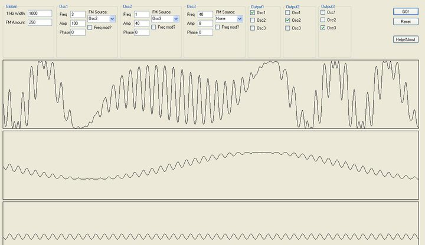
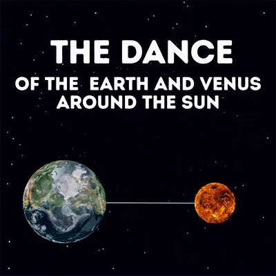

# Generative Art with JavaScript

## What I'm trying to achieve with this talk

- Something a bit different, a bit fun. 
- We'll talk about some technical specifics
- But otherwise we'll talk about how a side project like this can be useful for your own technical development. 
    - For example: 
        - Deploying a website
        - Data structures

## How I got here

I used to be into electronic music. 

Before I was a web developer - built this with C#/Java

Fastfoward a few years, I see this picture on Facebook

And I was like, yeah, that's cool, but if you take any two things rotating about a point and draw lines between them, they're going to create something cool looking. 

And doesn't Earth have an elliptical orbit? 

So I quickly created a demo using SVG and JQuery to make the point. 

(demo the Earth Venus Algorithm). 

And then I was like, 'yeah, that's cool, what if I added a third one? What if they orbitted each other?

And from there, I was a bit hooked. 

And this is actually where I started getting into React - I realised that JQuery wasn't going to cut it, so this was a good opportunity to learn a new framework. 

So over the next couple of years I learned: 

- React
- TypeScript (useful for the underlying algorithm)
- How do deploy a website to Heroku and to Firebase
- How to set up the DNS for my own domain name
- API integrations (Social media sharing). 

And a bunch of what not to do: 

- Don't roll your own components. (Use material-ui :thinking:)
    - Making things work for iPhone is difficult.  
- Don't mutate props 😮
- Is Object Oriented Programming still the way to go?

Where this project ultimately ground to a halt was that it was time consuming: 

- The idea I had in mind was that you'd be able to create an algorithm on the weekend, and that would be fun. 
- But where it really is, is not quite being happy with the UX. 
    - The look feel on different devices are different. 
    - I think for a while it didn't even work for iPhone
    - Tweaking the algorithm min/maxes is time consumer. 
    - Just what controls are relevant for the user? 
    - The random button actually takes a bit of the fun out of it. 
         - 'I used to collect stamps'.  
- I got a bit over the 'get big on social media' thing. 
    - A fair bit of the work was getting the social media sharing going. 
    - How would I do this on Instagram? 
    - But now I'm like, I don't know if I want to play that game. 

### Next Project - Tiny Massive

Turns out there are a bunch of generative art groups on Facebook etc. 

In one of them, someone advertised their light show in Iceland - asking for submissions for TinyMassive

This is a big building, essentially it's a 77x13 pixel array. 

My submission: 

https://tinymassive.herokuapp.com/

This submission was ultimately submitted, but I have no idea what it looked like. 

The idea I had was that people would use their smart phones to create submissions and it would go in a queue. But I had misread the submission guidelines, what they really wanted was for people to use a joy stick to control it. In anycase -the random function works fine. 

Things learned: 

- Entering light shows is a good practise, because it's timeboxed. 
- Using redux is good 
- I learned about using websockets. 

### Next project - White Night

A constant theme I've encounted so far, is the cludgeyness of the controls. 

So what about something that it's a bit more ethereal, so you don't have the users staring at a screen and getting confused. 

So what about physical interactions? 

- Initially I had thought about you could have balls that people throw around, and they have little arduinos in them tracking their XYZ coorderinates to control it. 
- But that's quite a lot of work. What about using the (that library), to trakc their feet? 
 - It's a C++ library - I couldn't get it working. 
- Wait, why not just use my webcam. It doesn't actually matter too much about being accurate. 

So that's what I've done on this submission. 

https://video-geoplanets.herokuapp.com/\

Things learned: 

- Using the webcam API
- Using p5.js
- 

